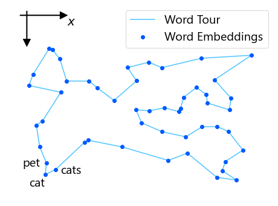
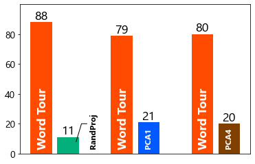

# Word Tour: One-dimensional Word Embeddings via the Traveling Salesman Problem

We proposed one-dimensional word embeddings.

Paper: https://arxiv.org/abs/2205.01954



## 💡 How to Use

`wordtour.txt` is the trained embeddings. The i-th line shows the i-th word in the tour. Note that the embeddings are circular, and thus the first line and the last line are next to each other.

## 📝 Results

### Examples of segments

Each row represents a segment. (a--d) Segments around "cat." (e--h) Segments around "concept." (i--o) Random segments of WordTour. WordTour provides smooth orderings.

|     | Methods | 1 | 2 | 3 | 4 | 5 | 6 | 7 | 8 | 9 | 10 | 11 |
| --- | --- | --- | --- | --- | --- | --- | --- | --- | --- | --- | --- | --- |
| (a) | WordTour | sniff | sniffing | sniffer | dogs | dog | cat | cats | pets | pet | stray | errant |
| (b) | RandProj | loire | sayings | nn | trooper | referendum | cat | exceeded | traces | freestyle | mirrored | bloomberg |
| (c) | PCA1 | mm | asylum | kohl | presents | expressed | cat | sichuan | denmark | counted | corporations | hewitt |
| (d) | PCA4 | 1.46 | puzzles | 940 | coexist | locations | cat | att | winners | perth | colgate | sohail |
| | | | | | | | | | | | | |
| (e) | WordTour | assumption | assumptions | notions | notion | idea | concept | concepts | ideas | thoughts | feelings | emotions |
| (f) | RandProj | entertaining | 42,000 | kursk | embarrassment | ingrained | concept | berezovsky | cg | guillen | excerpts | roofs |
| (g) | PCA1 | neighboring | branches | argued | manhattan | 1998 | concept | share | pending | response | airlines | fort |
| (h) | PCA4 | 2:00 | hksar | hashim | provider | straining | concept | inducing | fightback | unsettled | bavaria | sign |
| | | | | | | | | | | | | |
| (i) | WordTour | wireless | broadband | 3g | cdma | gsm | handset | handsets | smartphones | smartphone | blackberry | tablet |
| (j) | WordTour | gun | weapon | weapons | arms | arm | leg | legs | limbs | limb | prosthetic | make-up |
| (k) | WordTour | federalist | libertarian | progressive | liberal | conservative | conservatives | liberals | democrats | republicans | gop | republican |
| (l) | WordTour | cordial | amicable | agreeable | mutually | beneficial | detrimental | harmful | destructive | disruptive | behaviour | behavior |
| (m) | WordTour | 15th | 14th | 13th | 12th | 10th | 11th | 9th | 8th | 7th | 6th | 5th |
| (n) | WordTour | suspicions | doubts | doubt | doubted | doubting | doubters | skeptics | skeptic | believer | believers | adherents |
| (o) | WordTour | molten | magma | lava | basalt | sandstone | limestone | granite | marble | slab | slabs | prefabricated |

### Crawdsourcing Evaluation

Each bar represents the number of times each method was selected by crowdworkers within 100 trials.



### Document Classification

Each cell reports a kNN classification error. Lower is better. The time row reports the average time to compare the two documents. WordTour performs the best in the blurred BoW family.

| | ohsumed | reuter | 20news | amazon | classic |
| --- | --- | --- | --- | --- | --- |
| BoW | 48.1 | 5.6 | 35.4 | 11.4 ± 0.4 | 5.1 ± 0.3 |
| Time | 39 ns | 23 ns | 35 ns | 21 ns | 23 ns |
| | | | | | |
| WordTour | **47.2** | **4.6** | **34.1** | **10.1 ± 0.3** | **4.6 ± 0.1** |
| RandProj | 47.9 | 5.4 | 35.4 | 11.3 ± 0.3 | 5.1 ± 0.3 |
| PCA1 | 47.8 | 5.7 | 35.5 | 11.4 ± 0.6 | 5.1 ± 0.3 |
| PCA4 | 48.1 | 5.6 | 35.4 | 11.6 ± 0.5 | 5.1 ± 0.4 |
| Time | 206 ns | 142 ns | 312 ns | 185 ns | 150 ns |
| | | | | | |
| WMD | 47.5 | 4.5 | 30.7 | 7.6 ± 0.3 | 4.2 ± 0.3 |
| Time | 3.5 x 10^6 ns | 2.2 x 10^6 ns | 5.1 x 10^6 ns| 1.2 x 10^7 ns | 1.9 x 10^6 ns |

## ⛏️ How to Build WordTour by Yourself

1. Install the dependencies.

```
$ sudo apt install wget unzip build-essential
```

2. Download the GloVe embeddings and LKH solver.

```
$ ./download.sh
```

3. Compile the generator.

```
$ make
```

4. Create the LKH config file.

```
$ ./make_LKH_file
Usage: ./make_LKH_file [embedding file path] [#words]
$ ./make_LKH_file ./glove.6B/glove.6B.300d.txt 400 > ./LKH-3.0.6/wordtour.tsp
$ cp wordtour.par ./LKH-3.0.6/wordtour.par
```

Here, 400 is used for an illustration purpose. 40000 words may take a few minutes and consume a few GB of strage.

5. Compile the LKH solver.

```
$ cd LKH-3.0.6
$ make
```

6. Run the LKH solver.

```
$ ./LKH wordtour.par
```

Note: The result is saved in `wordtour.out`.

Note: It may take several hourds to run the LKH solver with 40000 words.

7. Extract the word list.

```
$ cd ..
$ python generate_order_file.py
$ cat wordtour.txt
```

## 🧪 How to Evaluate

1. Download the Datasets.

You also need to run `./download.sh` if you haven't yet.

```
$ ./download_datasets.sh
```

2. Preprocess.

```
$ python ./preprocess.py
```

3. Evaluate.

Be sure that the embeddings files, `wordtour.txt`, `order_randproj.txt`, `order_pca1.txt`, and `order_pca4.txt`, contain the embeddings you want to evaluate. It might contain only 400 words if you ran the "How to Build WordTour by Yourself" scripts.

```
$ python evaluate.py
```

## 🖋️ Citation

```
@inproceedings{sato2022wordtour,
  author    = {Ryoma Sato},
  title     = {Word Tour: One-dimensional Word Embeddings via the Traveling Salesman Problem},
  booktitle = {Proceedings of the 2022 Conference of the North American Chapter of the Association for Computational Linguistics: Human Language Technologies, {NAACL-HLT}},
  year      = {2022},
}
```

